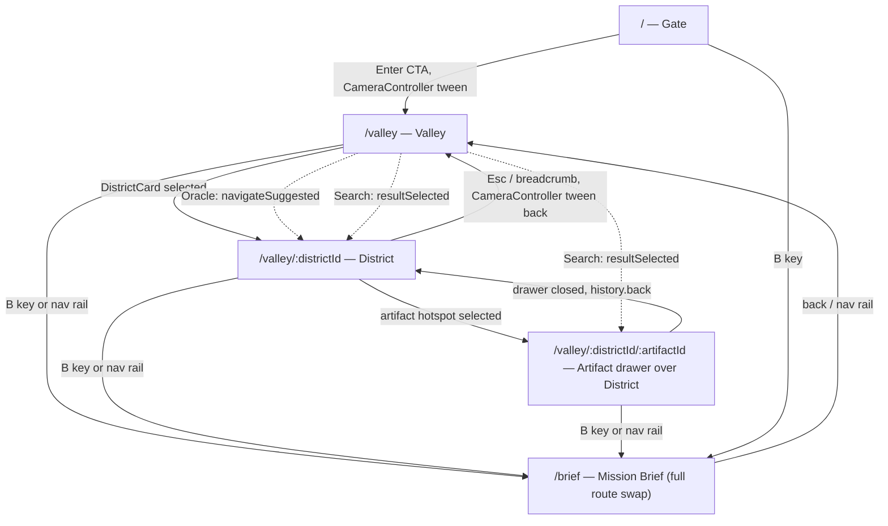

# Ninjatronics.io — Routing Specification
*docs/design/Routing Specification.md · implementation-ready for React Router · extends Frontend Architecture §01–02*

The routing contract for the application. `WorldCanvas`/`CameraController` own *visual* navigation (Motion Specification.md); this document owns the *URL* contract that drives them. The rule throughout: the camera is a view of the URL, never the other way around — a given URL always renders the same world state, and every camera position is reachable by URL.

---

## 1. Route Table

| Path | Renders | Notes |
|---|---|---|
| `/` | Gate (`BootSequence` → CTA) | Root. No world-state params. |
| `/valley` | Valley (`WorldCanvas` zoomed out, all `DistrictCard`s) | Camera framing: full map. |
| `/valley/:districtId` | District (`DistrictScene` for `districtId`) | Camera framing: that district. 404 if `districtId` not in `world.districts[]`. |
| `/valley/:districtId/:artifactId` | District with `ArtifactDrawer` open | Camera stays on the district framing; drawer is an overlay, not a separate camera state. 404 if `artifactId` doesn't belong to `districtId`. |
| `/brief` | Mission Brief | Full route swap — replaces `WorldCanvas` entirely, not layered over it. |
| `*` (unmatched) | 404 view | See §9. |

Overlay and modal "routes" (Oracle, Terminal, Search) are **not** separate paths under normal operation — they are UI state layered on top of whichever path is current (see §6, §7). They gain optional query-parameter representation only for shareability (see §5).

---

## 2. Nested Route Structure (React Router v6+ shape)

```
<Route path="/" element={<AppShell />}>
  <Route index element={<Gate />} />
  <Route path="valley" element={<WorldCanvasRoute />}>
    <Route index element={<ValleyView />} />
    <Route path=":districtId" element={<DistrictView />}>
      <Route path=":artifactId" element={<ArtifactOverlayOutlet />} />
    </Route>
  </Route>
  <Route path="brief" element={<MissionBrief />} />
  <Route path="*" element={<NotFound />} />
</Route>
```

`WorldCanvasRoute` is the single mount point for the camera-driven canvas; `ValleyView`/`DistrictView` do not unmount `WorldCanvas` between each other — they update `CameraController`'s target (per State Diagrams.md `WorldCanvas` machine). `ArtifactOverlayOutlet` renders `ArtifactDrawer` as a sibling overlay of `DistrictView`'s content, not a child route that replaces it — implemented as a nested `<Outlet>` that is `null` when no `artifactId` matches, non-null (rendering `ArtifactDrawer`) when it does.

---

## 3. Deep-Link Behavior

Every route in §1 must render correctly on a cold load (no client-side navigation history), including:

- `/valley/git-forest/ninjatronics-cli` loads directly into the Git Forest district with the correct artifact drawer already open, camera pre-positioned (no visible "fly-in from Gate" on cold load — `CameraController` initializes at the target position directly, animating only on *subsequent* client-side navigation, never on first paint).
- `/brief` loads Mission Brief with zero `WorldCanvas` mount cost — this route must not lazy-load the canvas bundle at all (code-split boundary, called out for Claude Code: `WorldCanvas` and its camera/scene dependencies are a separate chunk from `MissionBrief`).
- A locked district/artifact deep link (e.g. someone bookmarks a chamber before it unlocks) renders the locked-state view, not a 404 — the URL is always valid if the id exists in `world.json`, regardless of unlock status.

---

## 4. Browser History Behavior

- Each `CameraController`-driven navigation (`Valley → District`, `District → Artifact`, and their reverses) pushes a new history entry — back/forward must retrace the exact same path a manual click would (per State Diagrams.md `WorldCanvas` transitions).
- Opening `ArtifactDrawer` pushes history (`/valley/:d/:a`); closing it (Esc/X) calls `history.back()` rather than a fresh `navigate(-1 level)` push, so forward/back stays symmetric.
- Opening `OracleOverlay`/`TerminalOverlay`/`SearchOverlay` does **not** push a history entry by default (they're transient UI state, not a "place" in the world) — see §6 for the one exception (Oracle-initiated navigation).
- `Gate → Valley` (the one-way CTA commitment, per Motion Specification.md §1.1) pushes a history entry; pressing back from `/valley` to `/` re-shows the Gate in its `Ready` (post-boot) state, not a replayed `BootSequence` (matches `BootSequence`'s `skip` variant logic in State Diagrams.md).

---

## 5. URL Parameters &amp; Search Parameters

Path params (`:districtId`, `:artifactId`) are the primary state carriers, per §1. Query parameters are reserved for **optional, non-structural** state:

| Query param | Applies to | Purpose |
|---|---|---|
| `?ask=` | any route | Pre-fills and opens `OracleOverlay` with a query on load (e.g. a shared "ask the Oracle about Kubernetes" link) — see §6. |
| `?q=` | `/valley` or any | Pre-fills and opens `SearchOverlay` with a query on load. |
| `?theme=` | any (dev/QA use) | Overrides `ThemeProvider`'s `accentOverride` for demo/testing links — not user-facing UI, but must be supported since it's how accent variants (ki/sky/mind/ember) get shared as links during design review. |

No other component state (drawer scroll position, terminal history, toast queue) is ever encoded in the URL — those are session-local, not shareable state.

---

## 6. Overlay Routing (Oracle, Terminal, Search)

These are modeled as **UI state**, not routes, with one shareability exception:

- Default behavior: opening/closing `OracleOverlay`/`TerminalOverlay`/`SearchOverlay` is local component state inside `AppShell` (per State Diagrams.md `NavigationRail` machine) and does **not** change the URL.
- Exception — Oracle deep link: `?ask=<query>` (see §5) causes `AppShell` to open `OracleOverlay` and submit that query automatically on mount, so "ask the Oracle about X" can be a link recruiters/colleagues receive. This is read on mount only — the app does not continuously sync the live conversation back into the URL as it progresses.
- Oracle-initiated navigation (`navigateSuggested`, per State Diagrams.md) calls the exact same `navigate(path)` a manual `DistrictCard` click would — the Oracle does not have a private navigation mechanism; it drives the same router.

---

## 7. Modal Routing (`Modal`, `SearchOverlay`, `ArtifactDrawer`)

- `Modal`/`SearchOverlay` (generic, non-artifact): never own a distinct path; always UI state over the current path (with the `?q=` exception above).
- `ArtifactDrawer` is the one "modal-like" surface that **does** own a path segment (`:artifactId`), because an artifact is a real, permanent, linkable "place" in the world (Law I — every artifact maps to something real) — unlike Search/Oracle, which are transient tools, not places.

This is the deciding rule for future components: **if it represents a place or thing in `world.json`, it gets a path segment; if it's a tool for navigating or querying the world, it's UI state (optionally with a query-param deep-link).**

---

## 8. Mission Brief Routing

`/brief` is a full top-level route, sibling to `/` and `/valley`, not nested under `WorldCanvasRoute` — reflecting Component Specification.md's dependency graph note that `MissionBrief` "replaces `WorldCanvas`, not layered over it." Navigating to `/brief` from anywhere in the Valley/District/Artifact tree unmounts the canvas tree (freeing the code-split chunk from memory, not just visually hiding it) and mounts the document-style `MissionBrief` tree. The `B` keyboard shortcut (global, bound in `AppShell`) calls `navigate('/brief')`; there is no separate "close Mission Brief" state — the back button or any other nav control returns to wherever the visitor came from via normal history.

---

## 9. 404 Handling

- Unmatched top-level paths (`/anything-else`) render `NotFound` — same visual language as the rest of the app (dark, minimal, monospace), offering exactly two links: "Return to the Gate" (`/`) and "Mission Brief" (`/brief`). No canvas, no camera.
- Structurally-matched but semantically-invalid ids (`/valley/not-a-real-district`) are **not** a router-level 404 — `DistrictView` itself checks the id against `world.districts[]` and renders the same `NotFound` treatment inline, since the router alone can't validate against runtime data. Same pattern applies to `:artifactId` under a valid `:districtId`.
- `NotFound` is always server-renderable / crawlable plain content — it must not depend on `world.json` having loaded (it's often the state that occurs *because* something about the expected data didn't match).

---

## 10. Navigation Flow Diagram



No page reloads occur anywhere on this diagram — every edge is a client-side `navigate()` call paired with the corresponding `CameraController.goTo()` (solid edges) or is itself the mechanism that triggers one (dashed edges, from Oracle/Search).

---

## 11. Future Expansion Strategy

- **New IA level (e.g. a "sub-room" inside an artifact):** add a new optional path segment (`/valley/:districtId/:artifactId/:roomId`) following the same "place → path segment" rule from §7; `CameraController` gains a new target shape, no existing route changes.
- **New global tool overlay (e.g. a settings panel):** follows the "tool → UI state (+ optional query param)" rule from §7 — no new top-level route.
- **Versioned `world.json` schema changes:** routing contract is stable independent of schema version since routes reference ids, not shape — see World Compiler.md for schema evolution strategy.
- **Multi-language support (not in v1 scope):** would prefix the route table with a `/:locale` segment ahead of everything in §1 — flagged here only so the route table isn't designed in a way that would preclude it later (no locale-specific logic embedded in path structure today).

---

## Cross-references

- Camera behavior triggered by these routes is fully specified in Motion Specification.md §1.
- State machines referenced throughout (`WorldCanvas`, `NavigationRail`, `ArtifactDrawer`) are defined in State Diagrams.md — this document describes the URL layer that drives their `target`/`selected` events.
- `world.districts[]`/`world.artifacts[]` id validity referenced in §9/§1 comes from World Compiler.md's validation rules.
