# Ninjatronics.io — State Diagrams
*docs/design/State Diagrams.md · extends Component Specification.md*

State machines for every major interactive component, to eliminate ambiguity before implementation. Diagrams use Mermaid `stateDiagram-v2`. Each component also lists events, edge cases, loading/error states, and accessibility considerations not obvious from the diagram alone.

---

## AppShell

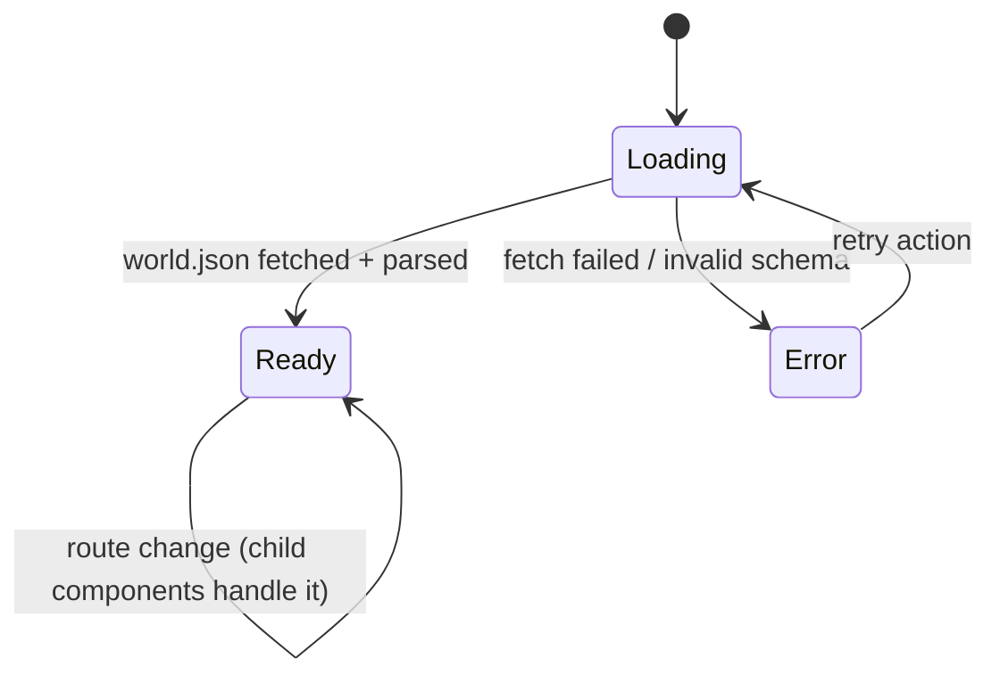

**Events:** `worldDataLoaded`, `worldDataFailed`, `retryRequested`.
**Edge cases:** slow network — `Loading` has no timeout-triggered auto-fallback; a manual "Skip to Mission Brief" link appears after 5s so a visitor is never stuck.  Malformed `world.json` (fails validation from World Compiler.md) is treated identically to a fetch failure, not a partial render.
**Loading state:** renders `BootSequence` only if the eventual route is Gate; any other deep-linked route (e.g. a shared Mission Brief link) shows `LoadingScreen` instead — the boot narrative belongs to Gate specifically.
**Error state:** static message + retry button + a Mission Brief link that works even without `world.json` for critical fields (name/contact are build-time constants, not world-data-dependent, as a resilience measure).
**Accessibility:** `Error` state content is a normal focusable document, not a canvas — fully usable with no JS beyond the retry click.

---

## WorldCanvas

```mermaid
stateDiagram-v2
    [*] --> Gate
    Gate --> Valley: enter action (BootSequence ready)
    Valley --> District: DistrictCard selected
    District --> Valley: Esc / breadcrumb / onExit
    District --> Artifact: artifact hotspot selected
    Artifact --> District: drawer closed
    Valley --> Gate: (not reachable in normal flow; only via direct URL nav)
    District --> District: switch district via NavigationRail/search without full Valley pass-through
```

**Events:** `districtSelected(id)`, `artifactSelected(id)`, `exitRequested`, `directTargetNavigated(level, id)` (from Search/Oracle/Terminal).
**Edge cases:** `directTargetNavigated` can jump straight from any state to `District` or `Artifact` (e.g. Oracle says "follow me to the Floating Citadel") — `CameraController` computes the tween from wherever the camera currently is, it does not force a pass through `Valley` first. Locked districts reject `districtSelected` (no state change; `DistrictCard` shows the locked affordance instead).
**Loading state:** while `CameraController` is mid-transition, `WorldCanvas` is in an implicit `transitioning` sub-state (pointer events suspended on outgoing layer — see Component Specification.md).
**Accessibility:** state changes announce the new location via the shared live region owned by `AppShell` (e.g. "Entered Cloud Temple").

---

## CameraController

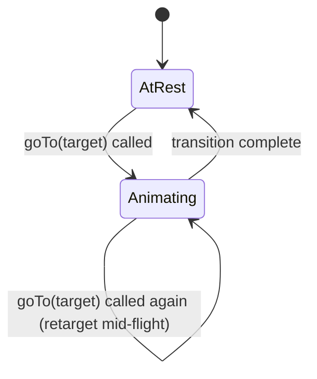

**Events:** `goTo(target)`, `zoomOut()` (sugar for `goTo(parentLevel)`), `transitionComplete`.
**Edge cases:** rapid repeated `goTo` calls (e.g. user mashing district tiles) always retarget from current interpolated position — never queues a backlog of pending moves, preventing runaway animation chains.
**Reduced-motion:** collapses `Animating` to a single-frame state — functionally `AtRest → AtRest` with an instant opacity crossfade, per Motion Specification.md §1.
**No error state** — this is pure client-side math, cannot fail independently of its inputs.

---

## BootSequence

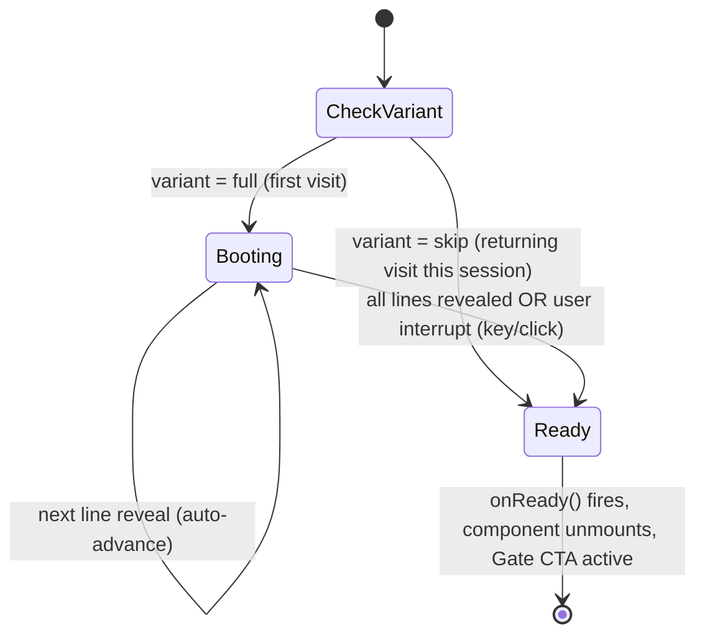

**Events:** `lineRevealed`, `userInterrupt`, `sequenceComplete`.
**Edge cases:** `userInterrupt` during `Booting` snaps directly to `Ready` — all remaining lines render at full opacity instantly rather than being skipped/hidden (visitor should see the final state, not a partial one). Stat values of `0` (e.g. a brand-new repo with no commits yet) still render their line — never conditionally hidden, per Law I (truth over fiction — zero is a real, honest value).
**Loading state:** N/A — this component *is* the loading/intro experience; it does not itself wait on further async data (stats are passed in already resolved by `AppShell`).
**Accessibility:** full text of all lines present in DOM at `Booting` start (Motion Specification.md §6) — screen reader users effectively experience `Ready` state semantics immediately regardless of visual state.

---

## OracleOverlay

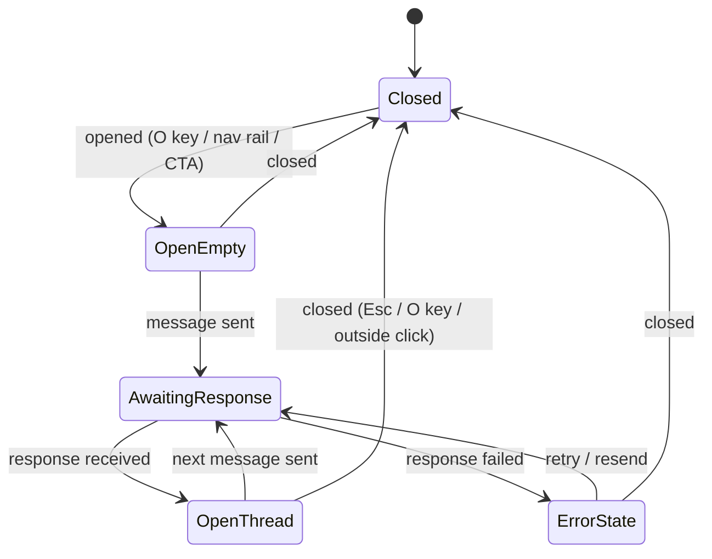

**Events:** `opened`, `closed`, `messageSent`, `responseReceived`, `responseFailed`, `navigateSuggested` (a response includes a "take me there" action — does not itself change `OracleOverlay`'s state, it dispatches to `WorldCanvas`/`CameraController` while the overlay may remain open or close, configurable by the user's click on that action specifically).
**Edge cases:** sending a message while `AwaitingResponse` is disabled (input locked, not queued) to avoid out-of-order responses. A `navigateSuggested` action taken while the overlay is a docked panel (desktop) leaves it open, docked, while the world navigates behind it; on mobile (full-screen variant) taking that action closes the overlay first, then navigates, since it can't be "behind" a full-screen surface.
**Loading state:** `AwaitingResponse` renders a typing-indicator variant of `GuardianDialogue` (three-dot pulse, ambient tier), not a generic `LoadingScreen`.
**Error state:** `ErrorState` renders an in-character Oracle line ("The signal is unclear — try again.") rather than a raw error message, keeping tone consistent even on failure.
**Accessibility:** new assistant messages announce via polite live region; input retains focus after send so multi-turn conversation doesn't require re-tabbing.

---

## TerminalOverlay

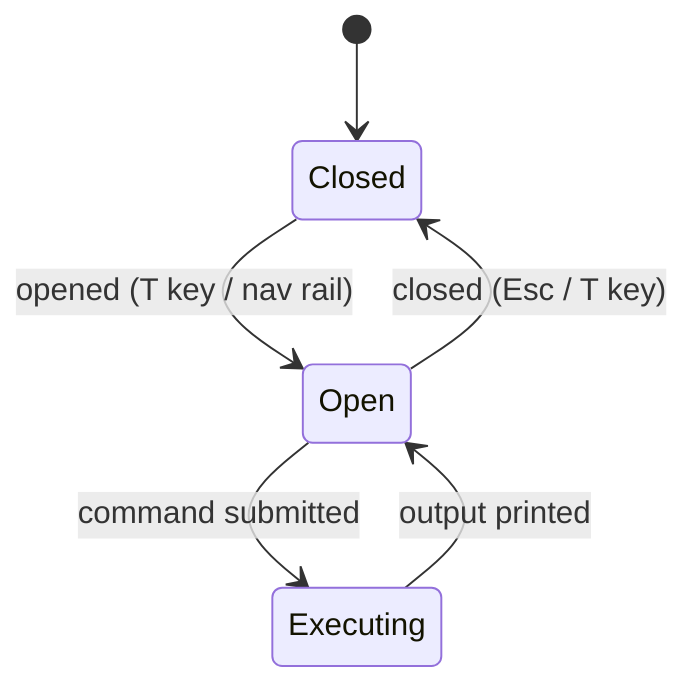

**Events:** `opened`, `closed`, `commandSubmitted`, `outputPrinted`, `historyNavigated` (↑/↓), `autocompleteRequested` (Tab).
**Edge cases:** unknown command prints a helpful error line (lists `help`) rather than nothing — never a silent no-op. `ask oracle "…"` as a command routes through the same Oracle response pipeline as `OracleOverlay`, printed inline via `GuardianDialogue`'s `inline` variant — this is a shared pipeline, not a duplicate implementation (Component Specification.md dependency graph).
**Loading state:** `Executing` shows the blinking-caret ambient state (Motion Specification.md §5) with no additional spinner — output prints as soon as ready.
**Accessibility:** output log is an `aria-live="polite"` region; command history navigation does not conflict with browser autofill (explicit `autocomplete="off"` on the input).

---

## SearchOverlay

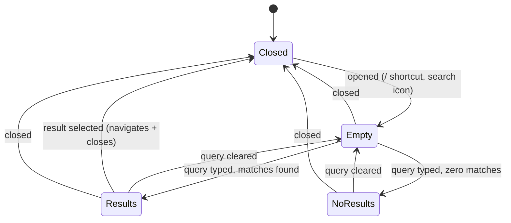

**Events:** `opened`, `closed`, `queryChanged`, `resultSelected`.
**Edge cases:** query matching both an open and a locked artifact/district shows both, with the locked one visibly marked (never hidden — consistent with "future goals in plain sight" from World Bible §02) but its selection is disabled with a tooltip explaining the lock.
**Loading state:** index is pre-built client-side from already-loaded `world.json`, so there is no async loading state for search itself.
**Accessibility:** combobox pattern — `aria-expanded`, `aria-activedescendant` tracks the highlighted result as arrow keys move.

---

## ArtifactDrawer

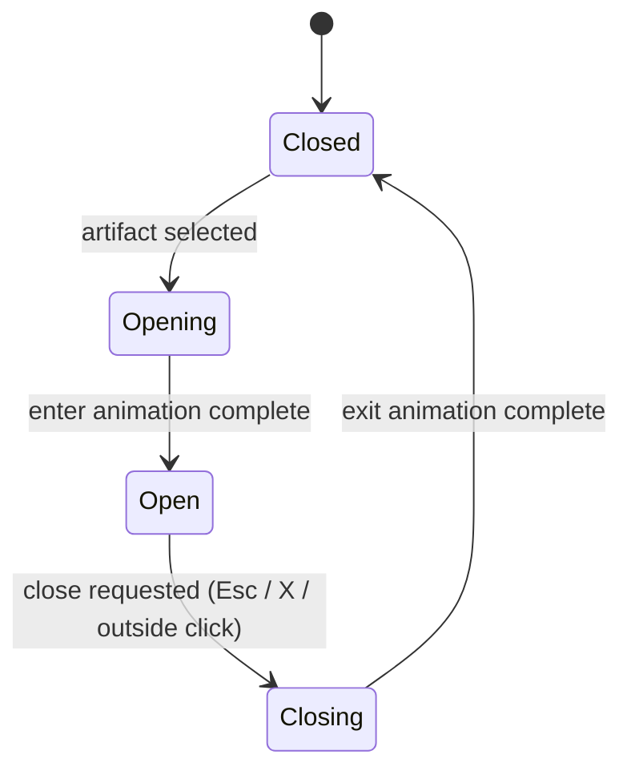

**Events:** `opened(artifactId)`, `closeRequested`, `animationComplete`.
**Edge cases:** selecting a *different* artifact while one is already `Open` does not go through `Closing` — content swaps in place (cross-fade the inner Card, per Motion Specification.md's overlay motion, without re-running the slide-in chrome animation) since the drawer chrome itself hasn't left the screen.
**Loading state:** artifact content is always already resolved (comes from `world.json` already in memory) — no async loading state exists for this component.
**Accessibility:** focus moves to the drawer's close button (or heading) on `Open`; returns to the triggering hotspot/card on `Closed`.

---

## MissionBrief

```mermaid
stateDiagram-v2
    [*] --> Default
    Default --> Print: browser print triggered
    Print --> Default: print dialog dismissed
```

**Events:** `printTriggered` (browser-native, listened via `window.matchMedia('print')` or `@media print`), none else — this view is intentionally static (Law IV, Component Specification.md).
**Edge cases:** none of note — by design, this is the lowest-complexity state machine in the app.
**Loading state:** N/A — same reasoning as `ArtifactDrawer`, content already resolved from `world.json`.
**Accessibility:** `Print` variant is a pure CSS media-query swap (print stylesheet), not a JS state requiring separate a11y handling.

---

## NavigationRail

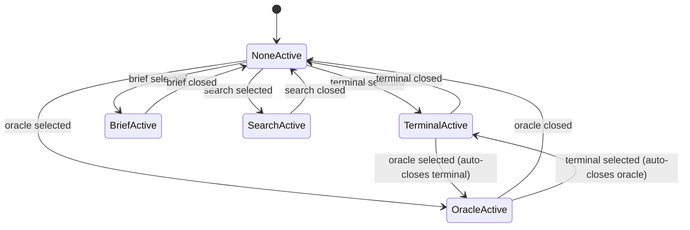

**Events:** `overlaySelected(overlay)`, `overlayClosed(overlay)`.
**Edge cases:** only one *docked* overlay (`Terminal`, `Oracle`) is active at a time — selecting one while another is open closes the first (both are bottom-docked panels and would visually collide). `Brief` is a full route swap, not a docked overlay, so selecting it while `Terminal`/`Oracle` is open closes them as a side effect of leaving `WorldCanvas` entirely. `Search` is a modal and can coexist over a docked overlay (rare but not visually conflicting — modal sits above in z-index per Design Tokens.md §10).
**Accessibility:** implemented as `role="tablist"`; only the active tab is `aria-selected="true"`.

---

## DistrictScene

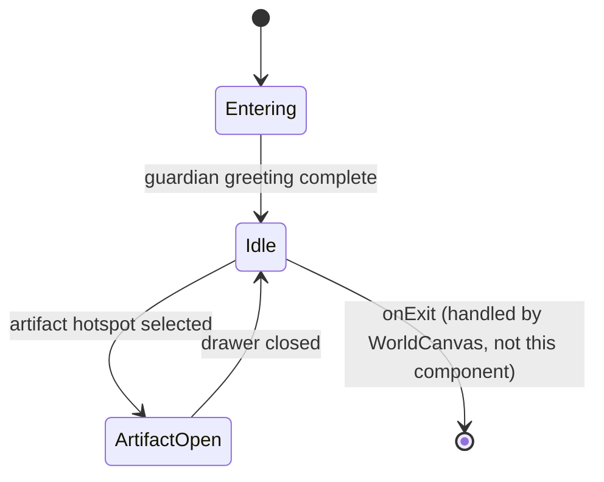

**Events:** `enterComplete`, `artifactSelected(id)`, `artifactClosed`.
**Edge cases:** a district in `partial` status (per World Bible §02) still reaches `Idle` normally — its *locked chambers* are individual `QuestCard`/`CertificationCard` instances in the locked state (Component Specification.md), not a district-level lock; only fully `locked` districts are prevented from being entered at all (handled in `DistrictCard`, not here).
**Loading state:** `Entering` is not a data-wait state, it's the guardian-greeting animation window (Motion Specification.md §1.2) — content is already available.
**Accessibility:** hotspots are in tab order starting immediately, independent of the `Entering` animation's visual completion (per the same DOM-immediacy principle used throughout).

---

## DistrictCard

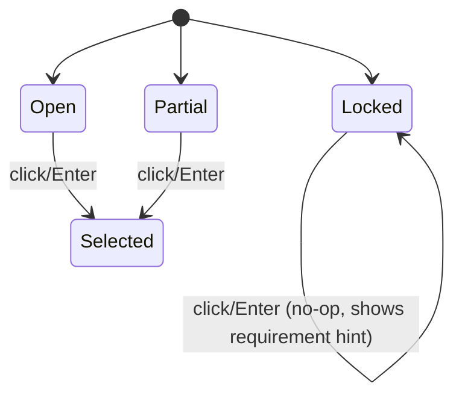

**Events:** `selected`, `hoverPreview` (visual only, not a formal state transition — see Motion Specification.md §3), `lockedInteractionAttempted`.
**Edge cases:** `Locked` is not a dead end from a communication standpoint — attempting to select it surfaces the unlock requirement (via `Tooltip`) rather than doing nothing silently, per the "future goals in plain sight" principle.
**Accessibility:** `Locked` cards carry `aria-disabled="true"` plus `aria-describedby` pointing to the requirement text, so the reason is available to AT even though the card isn't actionable.

---

## NotificationToast

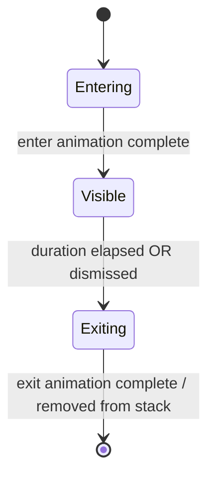

**Events:** `shown(toast)`, `dismissed`, `actionTaken`, `autoExpired`.
**Edge cases:** multiple toasts stack (newest at the bottom of the stack, oldest expires first) — no cap is hard-specified here, but implementation should guard against unbounded stacking (recommend a max of 3 visible, queue the rest) since Law III (calm, not urgent) argues against a wall of toasts.
**Accessibility:** `role="status"`, never `role="alert"` — matches the calm-not-urgent tone requirement (Component Specification.md).

---

## Timeline

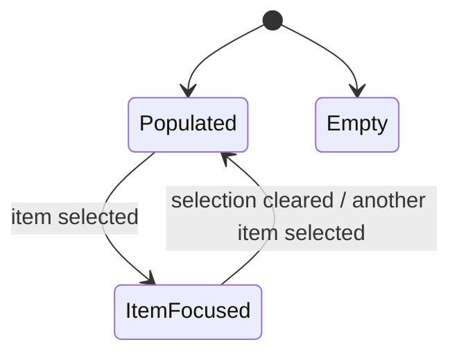

**Events:** `itemSelected(id)`.
**Edge cases:** `Empty` state is theoretically possible (a brand-new profile with no timeline events yet) but should never occur in production given Law I — if it does, render a plain "No events yet" line rather than an empty visual gap, so the layout doesn't look broken.
**Accessibility:** ordered list semantics regardless of state; `ItemFocused` is a visual/interaction detail (e.g. expands inline or triggers `onSelect` to open elsewhere) not a distinct accessibility tree structure.

---

## Cross-references

Trigger events named here (`districtSelected`, `artifactSelected`, `navigateSuggested`, etc.) are the same event vocabulary used in Routing Specification.md's navigation flow — the router listens for exactly these events rather than components calling `history.push` directly.
