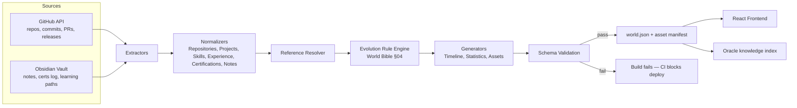
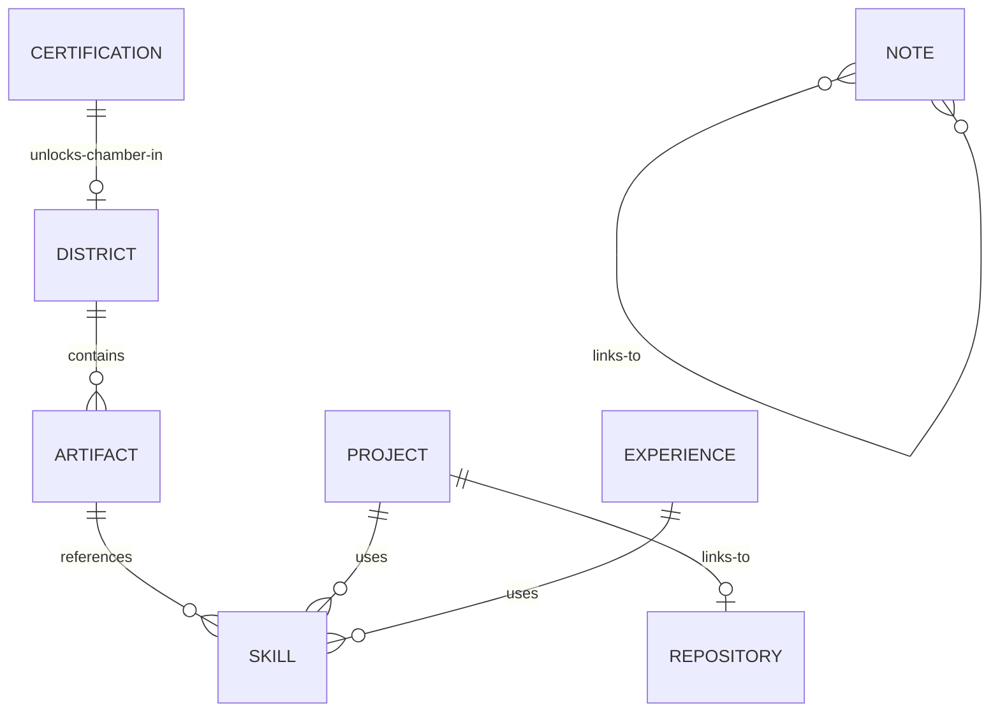

# Ninjatronics.io — World Compiler
*docs/design/World Compiler.md · extends World Bible §07 (System Architecture)*

How every real source of truth becomes `world.json`. This is the mechanism that makes the "living world" claim literal: the compiler is a deterministic, auditable pipeline — not a manual content-entry process — with real GitHub and Obsidian data on one side and the exact schema the frontend renders on the other.

---

## 1. Pipeline Overview

The compiler runs as a CI job (GitHub Actions), triggered on: a push to the GitHub account's tracked repos, a commit to the Obsidian vault repo (assuming vault is git-synced — see §11 if not), or a manual/scheduled run (nightly, as a safety net).

---

## 2. Compiler Responsibilities

1. **Extract** raw records from each source without interpretation (GitHub API responses, vault frontmatter + file tree).
2. **Normalize** raw records into the six canonical entity types (§3) — this is where source-specific quirks (GitHub's PR vs commit shape, Obsidian's frontmatter vs inline tags) are flattened into one consistent internal model.
3. **Resolve references** between entities (§5) — e.g. a Project's `stack` referencing Skill ids, a Certification unlocking a District chamber.
4. **Apply evolution rules** (§6) — deterministically decide what world-state changes given the normalized+resolved data (World Bible §04's table, implemented as code here).
5. **Generate derived data** — timeline (§8), statistics (§9), processed image assets (§7).
6. **Validate** the fully-assembled document against the schema (§4) before it's ever written.
7. **Emit** `world.json` plus a separate asset manifest; never partially — a failed validation blocks the entire emit, old `world.json` stays live (§10).

The compiler is the **only** thing that ever reads GitHub/Obsidian directly. The frontend never talks to either source — this is the literal implementation of Frontend Architecture's "the frontend is purely a renderer" rule.

---

## 3. Entity Model &amp; Relationships

| Entity | Sourced from | Key relationships |
|---|---|---|
| `Repository` | GitHub API | belongs to a `District` (by topic/tag mapping); may link to a `Project` |
| `Project` | Obsidian (project notes) + linked `Repository` | references `Skill[]` (stack), belongs to a `District`, may reference `Certification` (skills applied) |
| `Skill` | Obsidian (skill notes/frontmatter) + inferred from `Repository` languages | referenced by `Project`, `Experience`, `QuestCard` targets |
| `Experience` | Obsidian (career log) | belongs to no single District (cross-cutting) — surfaces in Mission Brief primarily |
| `Certification` | Obsidian (certs log) | unlocks a `District` chamber; references `Skill[]` it validates |
| `Note` | Obsidian (vault notes, published subset only) | belongs to Hall of Knowledge; contributes to knowledge-graph density stat |

`ARTIFACT` is the union type the frontend consumes (`type: project|certification|note|repository|experience|quest`, per Component Specification.md) — internally the compiler keeps the six entities distinct through normalization and resolution, then flattens them into `world.artifacts[]` only at the final generation step (§8).

---

## 4. Schema &amp; Validation Rules

The compiler validates against a versioned JSON Schema (`world.schema.json`) before emit. Validation categories:

- **Structural:** every required field present per entity type; correct primitive types (dates as ISO 8601, `progress` as 0–1 float, `level` as integer 1–5).
- **Referential integrity:** every `districtId` on an artifact must exist in `world.districts[]`; every skill id in a `stack[]` must exist in `world.skills[]`; every `unlocks` target on a `Certification` must be a real district/chamber id. A dangling reference fails the build (§10) — the frontend must never receive a reference it can't resolve.
 - **Content honesty (Law I enforcement):** no artifact may be marked `status: shipped` without a resolvable source commit/link; no `Certification` may be marked earned without a `dateEarned` and, where applicable, a `credentialUrl`. This is the compiler's enforcement mechanism for "nothing in the world is invented."
- **Uniqueness:** all entity ids unique across their type; slugs generated deterministically from source identifiers (e.g. a GitHub repo's `full_name`) so ids are stable across rebuilds — critical since URLs (Routing Specification.md) depend on id stability.
- **Media/asset:** every image reference resolves to a processed asset in the manifest (§7); missing assets fail the build rather than shipping a broken ``.

---

## 5. Reference Resolution

Resolution happens in two passes:

1. **Intra-source resolution:** e.g. matching an Obsidian project note's `repo:` frontmatter field to the corresponding GitHub `Repository` record by URL/name.
2. **Cross-entity resolution:** e.g. a `Skill` mentioned in a `Project`'s stack must resolve to a canonical `Skill` id — the resolver normalizes aliases (`"k8s"` → `kubernetes`, `"Obsidian"` in a note tag → the `Skill` id `knowledge-management` if such a mapping exists) via a maintained alias table, not fuzzy matching, to keep resolution deterministic and auditable.

Unresolvable references (a project references a skill with no matching canonical entry and no alias) are a **validation error**, not a silently-dropped reference — surfaced clearly in CI output with the source file/record responsible, so the fix is always "add the missing canonical entity or alias," never "the compiler guessed."

---

## 6. Evolution Rule Engine

Implements World Bible §04's table as executable rules. Each rule is a pure function: `(normalizedEntities, previousWorldState) → worldStateDelta`. Examples:

- `onProjectShipped`: when a `Project`'s status flips to `shipped` for the first time (detected by diffing against the previous build's `world.json`, not by any manual flag), emit a delta that adds it to `world.artifacts[]` and marks its district for a "new building" notification (consumed by `NotificationToast` on next visit, per Component Specification.md).
- `onCertificationEarned`: when a `Certification` entity appears with a `dateEarned` not present in the previous build, unlock its target chamber (`world.districts[].status` update, plus a `world.artifacts[]` entry flipping from `locked` to `earned`).
- `onGitHubActivity`: recomputes `Repository.stats` (commit counts, last updated) on every run regardless of diff — this rule always runs, it's continuous rather than edge-triggered, since it drives the Git Forest's live "growth ring" visualization directly from current stats rather than a discrete event.
- `onNotePublished`: a vault note moving from draft to published state (frontmatter flag) adds it to `world.artifacts[]` (`type: note`) and increments the knowledge-graph density statistic.

Rules are additive and independently testable — Claude Code (or any implementer) should be able to unit test `onCertificationEarned` against a fixture pair of (before, after) normalized data without running the full pipeline.

---

## 7. Asset Generation &amp; Image Handling

- Source images (project screenshots, certification badges, guardian art) live in the vault or a dedicated assets repo, never inline in `world.json` (which stays pure data).
- The compiler generates: a responsive srcset (avoiding one oversized image shipped to mobile), a stable content-hashed filename (cache-busting without manual versioning), and a manifest entry mapping the logical asset id used in `world.json` to its physical processed path.
- Certification badge images are the one asset class allowed to come directly from the issuer (e.g. Credly) — the compiler fetches and caches them at build time rather than hot-linking, so the site never breaks due to a third-party outage.
- Missing/unprocessable images fail validation (§4) rather than shipping a broken image reference — matches the "no placeholder content" principle at the data layer, not just the UI layer.

---

## 8. Timeline Generation

`world.timeline[]` is fully derived, never hand-authored: every entity with a date (a project's ship date, a certification's earned date, a note's publish date, an experience's start date) is projected into a single chronologically-sorted list with a `type` discriminator and back-references to its source entity id. Regenerated in full on every build (cheap, deterministic) rather than incrementally patched — this avoids drift between the timeline and the entities it summarizes.

---

## 9. Statistics Generation

`world.stats` (uptime days, total/weekly commits, notes count, certs count, repos count) are computed fresh each build from the normalized entity sets — never manually maintained counters. `uptimeDays`, specifically, is computed against a fixed epoch (homelab/first-commit date) stored as compiler config, not derived from any single source, since it spans the whole career rather than one system.

---

## 10. Cache Strategy &amp; Incremental Builds

- **Source-level caching:** GitHub API responses are cached (ETags) between runs — a scheduled nightly run that finds no changes produces a byte-identical `world.json` and skips the emit/deploy step entirely (avoids noisy no-op deploys).
- **Incremental normalization:** only entities whose source records changed (by hash) are re-normalized; unchanged entities are reused from the previous build's intermediate cache — full re-normalization is a fallback path (schema version bump, cache invalidation), not the common case.
- **Full re-validation always runs** even on incremental builds — validation is cheap relative to extraction/normalization and must never be skipped, since it's the last line of defense against emitting a broken document.
- **Failure isolation:** if validation fails, the previous known-good `world.json` remains live in production (the CI job does not deploy on failure) — the world can go stale for a cycle, but it can never go *broken*.

---

## 11. Adding a New Project — Worked Example

1. Gerso finishes a project, pushes the final commit to its GitHub repo, and adds a project note in the Obsidian vault with frontmatter linking the repo and listing the stack.
2. Next compiler run: GitHub extractor picks up the repo's latest state; Obsidian extractor picks up the new project note.
3. Normalizer produces a `Project` entity; Reference Resolver links its `stack[]` to canonical `Skill` ids and its `repo:` field to the matching `Repository` entity.
4. `onProjectShipped` evolution rule fires (status diff against previous build) → delta: new `world.artifacts[]` entry, district marked for a "new building" notification.
5. Generators recompute the timeline (new dated entry) and statistics (repo count / commit stats refresh).
6. Schema validation passes (all references resolve, required fields present, source link verifiable).
7. `world.json` + asset manifest emit; CI deploys the updated site.
8. On a returning visitor's next session, `NotificationToast` (Component Specification.md) surfaces "a new building has risen in the Git Forest" and the district visually contains the new artifact — with zero manual UI work required for this specific project.

This is the concrete proof of World Bible §07's claim: *"evolution is just a diff."*

---

## 12. Future Plugin Architecture

The extractor/normalizer boundary (§2, steps 1–2) is intentionally the plugin seam: a new source (e.g. a conference-talks calendar, a Goodreads export for "books completed", a mentorship-tracking sheet) is added as a new **Extractor + Normalizer pair** producing one of the existing six canonical entity types (or a seventh, if genuinely novel) — it does not require changes to Reference Resolution, the Rule Engine, Generators, or Validation, all of which operate on the normalized model, not the source shape. A plugin contract (conceptual, for future implementation): `extract(): RawRecord[]`, `normalize(raw: RawRecord[]): CanonicalEntity[]`. Claude Code should structure the initial GitHub/Obsidian extractors to already honor this interface, even though only two plugins exist at launch — so a third is additive, not a refactor.

---

## Cross-references

- The evolution rules implemented here are the executable form of World Bible §04's table — that document is the intent, this one is the mechanism.
- `world.json`'s shape as consumed by components is summarized in Component Specification.md's "world.json shape assumed by this spec" section; this document is the authoritative source for the *full* schema (`world.schema.json`), of which that summary is a simplified excerpt.
- Routing Specification.md's id-validity assumptions (§9 there) are guaranteed by this document's referential-integrity validation (§4 here).
